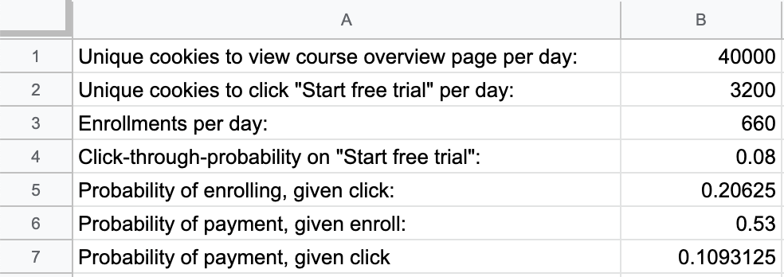

My implementation of Udacity A/B Testing course final project (ref: https://classroom.udacity.com/courses/ud257).

# Experiment Overview: Free Trial Screener

At the time of this experiment, Udacity courses currently have two options on the course overview page: "start free trial", and "access course materials". If the student clicks "start free trial", they will be asked to enter their credit card information, and then they will be enrolled in a free trial for the paid version of the course. After 14 days, they will automatically be charged unless they cancel first. If the student clicks "access course materials", they will be able to view the videos and take the quizzes for free, but they will not receive coaching support or a verified certificate, and they will not submit their final project for feedback.

In the experiment, Udacity tested a **change** where if the student clicked "start free trial", they were asked **how much time they had available to devote to the course**. If the student indicated 5 or more hours per week, they would be taken through the checkout process as usual. If they indicated fewer than 5 hours per week, a message would appear indicating that Udacity courses usually require a greater time commitment for successful completion, and suggesting that the student might like to access the course materials for free. At this point, the student would have the option to continue enrolling in the free trial, or access the course materials for free instead. This screenshot below shows what the experiment looks like.

 


The **hypothesis** was that this might set clearer expectations for students upfront, thus **reducing the number of frustrated students who left the free trial** because they didn't have enough time —**without significantly reducing the number of students to continue past the free trial and eventually complete the course**. If this hypothesis held true, Udacity could improve the overall student experience and improve coaches' capacity to support students who are likely to complete the course.


The **unit of diversion is a cookie**, although if the student enrolls in the free trial, they are tracked by user-id from that point forward. The same user-id cannot enroll in the free trial twice. For users that do not enroll, their user-id is not tracked in the experiment, even if they were signed in when they visited the course overview page.

# Experiment Design

## Metric Choice

There are several metrics that can be chosen. 

**Note**:
* Any place "unique cookies" are mentioned, the uniqueness is determined by day. (That is, the same cookie visiting on different days would be counted twice.)

* User-ids are automatically unique since the site does not allow the same user-id to enroll twice.

The definition and practical significance boundaries (in absolute changes) are given as follows:

- Number of cookies: That is, number of unique cookies to view the course overview page. ($d_{min}=3000$)

- Number of user-ids: That is, number of users who enroll in the free trial. ($d_{min}=50$)

- Number of clicks: That is, number of unique cookies to click the "Start free trial" button (which happens before the free trial screener is trigger). ($d_{min}=240$)

- Click-through-probability: That is, number of unique cookies to click the "Start free trial" button divided by number of unique cookies to view the course overview page. ($d_{min}=0.01$)

- Gross conversion: That is, number of user-ids to complete checkout and enroll in the free trial divided by number of unique cookies to click the "Start free trial" button. ($d_{min}=0.01$)

- Retention: That is, number of user-ids to remain enrolled past the 14-day boundary (and thus make at least one payment) divided by number of user-ids to complete checkout. ($d_{min}=0.01$)

- Net conversion: That is, number of user-ids to remain enrolled past the 14-day boundary (and thus make at least one payment) divided by the number of unique cookies to click the "Start free trial" button. ($d_{min}=0.0075$)


**Invariant metrics**

1. **Number of cookies** (# unique cookies to view the course overview page)

Number of cookies is recorded when users arrive at Udacity course overview page. It is not affected by the experiment which happens later. In addition, as unit of diversion, this metric is expected to be roughly evenly distributed among experiment and control group.

2. **Number of clicks** (# unique cookies to click the "Start free trial" button)

The action of clicking happens before the free trial screener is triggered, so it should be invariant among both groups. In addition, this metric is expected to be roughly evenly distributed among experiment and control group.

3. **Click-through-probability** (# user-ids to enroll in free trial/# unique cookies to click the "Start free trial" button)

Similarly, both the denominator and numerator happen before the free trial screener is triggered, so it should be invariant among both groups.


**Evaluation metrics**

Recall, the hypothesis is the change would **reduce the number of frustrated students who left the free trial** because they didn't have enough time —**without significantly reducing the number of students to continue past the free trial and eventually complete the course**.

Therefore, the goal is to 

(a) reduce the number of users who leave the free trial (in experiment group)

(b) keep the number of users who pay for courses roughly the same (in control and experiment group)

(c) improve the overall student experience and improve coaches' capacity to support students who are likely to complete the course (high-level concept)


1. **Gross conversion** (# user-ids to enroll in the free trial/# unique cookies to click the "Start free trial" button)

If the hypothesis holds, gross conversion should be lower in experiment group. (Some users are persuaded not to take the free trial)

2. **Retention** (# user-ids to remain enrolled past the 14-day boundary and thus make payment/# user-ids to enroll in free trial)

If the hypothesis holds, gross conversion should be higher in experiment group. (The trial screener filters out the users who don't have enough time commitment, thus the remaining ones are more likely to complete the whole course and thus pay for the course)

3. **Net conversion** (# user-ids to remain enrolled past the 14-day boundary and thus make payment/# unique cookies to click the "Start free trial" button)

If the hypothesis holds, the net conversion should be higher in experiment group. (The trial screener should filter out some students who don't have enought study time, thus the probability of remaining enrolled past the 14-day boundary should be higher in experiment group.)

## Measuring Standard Deviation

For each of the metrics the standard deviation is calculated for a sample size of 5000 unique cookies visiting the course overview page. The calculation is based on the baseline values given by Udacity.

 


The three evaluation metrics are all probabilities. Thus Binomial distribution could be used to estimate their standard deviations. 

The formula is $\sqrt{\cfrac{p*(1-p)}{n}}$, where $n$ is the denominator of each metric


```python
# baseline values
pageviews = 40000
clicks = 3200
enrollments = 660
ctp = 0.08
enroll_click = 0.20625 # enroll/click, gross conversion
pay_enroll = 0.53 # payment/enroll, retention
pay_click = 0.1093125 # payment/click, net conversion
```


```python
import math
n_sample = 5000
ratio = n_sample/pageviews
sd_gross_conversion = math.sqrt((enroll_click*(1-enroll_click)/clicks)/ratio)
sd_retention = math.sqrt((pay_enroll*(1-pay_enroll)/enrollments)/ratio)
sd_net_conversion = math.sqrt((pay_click*(1-pay_click)/clicks)/ratio)

print("Standard deviation of gross conversion is {}\n\
Standard deviation of retention is {}\n\
Standard deviation of net conversion is {}".format(round(sd_gross_conversion,4),\
                                                   round(sd_retention,4),\
                                                   round(sd_net_conversion,4)))
```

    Standard deviation of gross conversion is 0.0202
    Standard deviation of retention is 0.0549
    Standard deviation of net conversion is 0.0156


**Expect the analytic estimates to be accurate?**

When the **unit of diversion** is the same as the **unit of analysis**, the analytical standard deviation will match the empirical standard deviation, otherwise the empirically computed variability may be much higher than analytically computed one. 

**Note**:
Unit of analysis is the denominator of the metric. Unit of diversion in this experiment is cookie.

For **gross conversion** and **net conversion**, unit of diversion and unit of analysis are the same (both are cookie). For **retention**, unit of analysis is user-id which is different from unit of diversion. Therefore, the analytic estimates of standard deviation for **gross conversion** and **net conversion** would be close to empirical ones, while there may be large difference for **retention**. 

## Sizing

###  Choosing Number of Samples given Power

Using the analytic estimates of variance, how many pageviews total (across both groups) would you need to collect to adequately power the experiment? Use an alpha of 0.05 and a beta of 0.2.

The calculation was done by online calculator https://www.evanmiller.org/ab-testing/sample-size.html.


```python
import pandas as pd
pd.DataFrame({"Metric":["gross conversion","retention","net conversion"],"Baseline":["20.625%","53%","10.93125%"],\
              "Minimum Detectable Effect":[0.01,0.01,0.0075],"alpha":[0.05,0.05,0.05],"beta":[0.2,0.2,0.2],\
             "Sample Size per group(calculated)":["25,835 clicks","39,115 enrolls","27,413 clicks"],\
             "Total Sample Size":["51,670 clicks","78,230 enrolls","54,826 clicks"],\
             "Total pageviews":["645,975 pageviews","4,741,212 pageviews","685,325 pageviews"]})
```


<div>
<style scoped>
    .dataframe tbody tr th:only-of-type {
        vertical-align: middle;
    }

    .dataframe tbody tr th {
        vertical-align: top;
    }

    .dataframe thead th {
        text-align: right;
    }
</style>
<table border="1" class="dataframe">
  <thead>
    <tr style="text-align: right;">
      <th></th>
      <th>Metric</th>
      <th>Baseline</th>
      <th>Minimum Detectable Effect</th>
      <th>alpha</th>
      <th>beta</th>
      <th>Sample Size per group(calculated)</th>
      <th>Total Sample Size</th>
      <th>Total pageviews</th>
    </tr>
  </thead>
  <tbody>
    <tr>
      <th>0</th>
      <td>gross conversion</td>
      <td>20.625%</td>
      <td>0.0100</td>
      <td>0.05</td>
      <td>0.2</td>
      <td>25,835 clicks</td>
      <td>51,670 clicks</td>
      <td>645,975 pageviews</td>
    </tr>
    <tr>
      <th>1</th>
      <td>retention</td>
      <td>53%</td>
      <td>0.0100</td>
      <td>0.05</td>
      <td>0.2</td>
      <td>39,115 enrolls</td>
      <td>78,230 enrolls</td>
      <td>4,741,212 pageviews</td>
    </tr>
    <tr>
      <th>2</th>
      <td>net conversion</td>
      <td>10.93125%</td>
      <td>0.0075</td>
      <td>0.05</td>
      <td>0.2</td>
      <td>27,413 clicks</td>
      <td>54,826 clicks</td>
      <td>685,325 pageviews</td>
    </tr>
  </tbody>
</table>
</div>


The maximum of the total pageviews is 4,741,212 and thus this is the requried pageviews total.

### Choosing Duration vs. Exposure

Udacity has 40,000 pageviews per day and the required pageviews total is 4,741,212. We need 4,741,212/40,000 = 119 days to run the experiment if we use 100% Udacity's traffic. This is unreasonably long and I should reconsider my earlier decision about evaluation metric choice. Retention is not an appropriate metric for the test. The evaluation metrics now reduce to **gross conversion** and **net conversion**. 

Now, the required pageviews total is 685,325. If we use 100% Udacity's traffic, 685,325/40,000 = 18 days are needed. This is a reasonable time length. However, it's a little bit risky since there is no more traffic for other tests. I believe setting the fraction of traffic exposed to be 0.8 would be reasonable. Given this, it would take 22 days to run the experiement (which is roughly 3 weeks, reasonable). 

# Experiment Analysis

## Sanity Checks

For each of the invariant metrics (**Number of cookies**, **Number of clicks**, **Click-through-probability**), I calculated the 95% confidence interval for the value I expect to observe, the actual observed value, and whether the metric passes my sanity check. 

**Number of cookies**

- calculated by the data in `Pageviews` column
- each cookie is randomly assigned to control or experiment group with probability 0.5
- standard deviation of number of cookies: $\sqrt{\cfrac{0.5\times0.5}{n_{ctrl}+n_{exp}}}$
- margin of error: $SD\times Zscore$
- CI around 0.5: $[0.5-margin,0.5+margin]$
- check whether observed fraction is within the interval


```python
ctrl = pd.read_excel("./data/Final Project Results.xlsx",sheet_name="Control")
exp = pd.read_excel("./data/Final Project Results.xlsx",sheet_name="Experiment")
cookie_ctrl = ctrl['Pageviews']
cookie_exp = exp['Pageviews']
sd_cookie = math.sqrt(0.25/(cookie_ctrl.sum()+cookie_exp.sum()))
m = 1.96 * sd_cookie
CI_l, CI_u = 0.5-m, 0.5+m
p_hat = cookie_ctrl.sum()/(cookie_exp.sum()+cookie_ctrl.sum())

pd.DataFrame({"Lower bound":[round(CI_l,4)],"Upper bound":[round(CI_u,4)],"Observed":[round(p_hat,4)]})
```


<div>
<style scoped>
    .dataframe tbody tr th:only-of-type {
        vertical-align: middle;
    }

    .dataframe tbody tr th {
        vertical-align: top;
    }

    .dataframe thead th {
        text-align: right;
    }
</style>
<table border="1" class="dataframe">
  <thead>
    <tr style="text-align: right;">
      <th></th>
      <th>Lower bound</th>
      <th>Upper bound</th>
      <th>Observed</th>
    </tr>
  </thead>
  <tbody>
    <tr>
      <th>0</th>
      <td>0.4988</td>
      <td>0.5012</td>
      <td>0.5006</td>
    </tr>
  </tbody>
</table>
</div>


The confidence interval includes observed value, so the sanity check of Cookies passes.

**Number of clicks**

- calculated by `Clicks` column
- each group should have roughly the same number of clicks (probability is 0.5)
- standard deviation of number of clicks: $\sqrt{\cfrac{0.5\times0.5}{n_{ctrl}+n_{exp}}}$
- margin of error: $SD\times Zscore$
- CI around 0.5: $[0.5-margin,0.5+margin]$
- check whether observed fraction is within the interval


```python
click_ctrl = ctrl['Clicks']
click_exp = exp['Clicks']
sd_click = math.sqrt(0.25/(click_ctrl.sum()+click_exp.sum()))
m = 1.96 * sd_click
CI_l, CI_u = 0.5-m, 0.5+m
p_hat = click_ctrl.sum()/(click_ctrl.sum()+click_exp.sum())

pd.DataFrame({"Lower bound":[round(CI_l,4)],"Upper bound":[round(CI_u,4)],"Observed":[round(p_hat,4)]})
```


<div>
<style scoped>
    .dataframe tbody tr th:only-of-type {
        vertical-align: middle;
    }

    .dataframe tbody tr th {
        vertical-align: top;
    }

    .dataframe thead th {
        text-align: right;
    }
</style>
<table border="1" class="dataframe">
  <thead>
    <tr style="text-align: right;">
      <th></th>
      <th>Lower bound</th>
      <th>Upper bound</th>
      <th>Observed</th>
    </tr>
  </thead>
  <tbody>
    <tr>
      <th>0</th>
      <td>0.4959</td>
      <td>0.5041</td>
      <td>0.5005</td>
    </tr>
  </tbody>
</table>
</div>


The confidence interval includes observed value, so the sanity check of Cookies passes.

**Click-through probability**

- calculated by clicks/pageviews (CTP)
- we are now comparing two samples with different observations, so we need to choose a standard deviation that gives us a good comparison of both -> pooled standard deviation
- $\hat{p}_{pool} = \cfrac{click_{ctrl}+click_{exp}}{cookie_{ctrl}+cookie_{exp}}$
- $SD_{pool} = \sqrt{\hat{p}_{pool}(1-\hat{p}_{pool})(\cfrac{1}{n_{ctrl}}+\cfrac{1}{n_{exp}})}$
- $\hat{d} = \hat{p}_{exp}-\hat{p}_{ctrl}$, $\hat{d} \sim{} N(0,SD^2_{pool})$
- margin of error: $SD_{pool}\times1.96$
- CI around 0: $[-margin,+margin]$
- check whether $\hat{d}$ is within the interval


```python
tot_click_ctrl = click_ctrl.sum()
tot_click_exp = click_exp.sum()
tot_cookie_ctrl = cookie_ctrl.sum()
tot_cookie_exp = cookie_exp.sum()
p_exp = tot_click_exp/tot_cookie_exp
p_ctrl = tot_click_ctrl/tot_cookie_ctrl
d_hat = p_exp-p_ctrl
p_pool = (tot_click_ctrl+tot_click_exp)/(tot_cookie_ctrl+tot_cookie_exp)
sd_pool = math.sqrt(p_pool*(1-p_pool)*(1/tot_cookie_ctrl+1/tot_cookie_exp))
m = sd_pool*1.96
CI_l, CI_u = -m, m

pd.DataFrame({"Lower bound":[round(CI_l,4)],"Upper bound":[round(CI_u,4)],"Observed":[round(d_hat,4)]})
```


<div>
<style scoped>
    .dataframe tbody tr th:only-of-type {
        vertical-align: middle;
    }

    .dataframe tbody tr th {
        vertical-align: top;
    }

    .dataframe thead th {
        text-align: right;
    }
</style>
<table border="1" class="dataframe">
  <thead>
    <tr style="text-align: right;">
      <th></th>
      <th>Lower bound</th>
      <th>Upper bound</th>
      <th>Observed</th>
    </tr>
  </thead>
  <tbody>
    <tr>
      <th>0</th>
      <td>-0.0013</td>
      <td>0.0013</td>
      <td>0.0001</td>
    </tr>
  </tbody>
</table>
</div>


The confidence interval includes observed value, so the sanity check of Cookies passes.

## Result Analysis

### Effect Size Tests

For each of your evaluation metrics, computed a 95% confidence interval around the difference between the experiment and control group.

**Gross conversion**

- $d_{min} = 0.01$
- calculated by enrollment/click
- $\hat{gross}_{pool} = \cfrac{enrollment_{ctrl}+enrollment_{exp}}{click_{ctrl}+click_{exp}}$
- $SD_{pool} = \sqrt{\hat{gross}_{pool}(1-\hat{gross}_{pool})(\cfrac{1}{n_{ctrl}}+\cfrac{1}{n_{exp}})}$
- $\hat{d} = \hat{gross}_{exp}-\hat{gross}_{ctrl}$, $\hat{d} \sim{} N(0,SD^2_{pool})$
- margin of error: $SD_{pool}\times1.96$
- CI around true gross conversion: $[\hat{d}-margin,\hat{d}+margin]$
- check whether 0 is within the interval


```python
enroll_ctrl = ctrl['Enrollments']
enroll_exp = exp['Enrollments']
tot_enroll_ctrl = enroll_ctrl.sum()
tot_enroll_exp = enroll_exp.sum()

n = len(enroll_ctrl)-enroll_ctrl.isna().sum() # not every row has enrollment record
tot_click_ctrl2 = click_ctrl[0:n].sum()
tot_click_exp2 = click_exp[0:n].sum()
gross_exp = tot_enroll_exp/tot_click_exp2
gross_ctrl = tot_enroll_ctrl/tot_click_ctrl2
d_hat = gross_exp-gross_ctrl
gross_hat = (tot_enroll_ctrl+tot_enroll_exp)/(tot_click_ctrl2+tot_click_exp2)
sd_pool = math.sqrt(gross_hat*(1-gross_hat)*(1/tot_click_ctrl2+1/tot_click_exp2))
m = sd_pool*1.96
CI_l, CI_u = d_hat-m, d_hat+m

pd.DataFrame({"Lower bound":[round(CI_l,4)],"Upper bound":[round(CI_u,4)],"Observed":[round(d_hat,4)]})
```


<div>
<style scoped>
    .dataframe tbody tr th:only-of-type {
        vertical-align: middle;
    }

    .dataframe tbody tr th {
        vertical-align: top;
    }

    .dataframe thead th {
        text-align: right;
    }
</style>
<table border="1" class="dataframe">
  <thead>
    <tr style="text-align: right;">
      <th></th>
      <th>Lower bound</th>
      <th>Upper bound</th>
      <th>Observed</th>
    </tr>
  </thead>
  <tbody>
    <tr>
      <th>0</th>
      <td>-0.0291</td>
      <td>-0.012</td>
      <td>-0.0206</td>
    </tr>
  </tbody>
</table>
</div>


$0$ is not included in the CI => it's statistically significant (i.e. $H_0$ is rejected at 5% significance level).

$d_{min} = 0.01$ (in absolute changes) is not included in the CI => it's practically significant. 

**Net conversion**

- $d_{min} = 0.0075$
- calculated by payment/click
- $\hat{net}_{pool} = \cfrac{payment_{ctrl}+payment_{exp}}{click_{ctrl}+click_{exp}}$
- $SD_{pool} = \sqrt{\hat{net}_{pool}(1-\hat{net}_{pool})(\cfrac{1}{n_{ctrl}}+\cfrac{1}{n_{exp}})}$
- $\hat{d} = \hat{net}_{exp}-\hat{net}_{ctrl}$, $\hat{d} \sim{} N(0,SD^2_{pool})$
- margin of error: $SD_{pool}\times1.96$
- CI around true net conversion: $[\hat{d}-margin,\hat{d}+margin]$
- check whether 0 is within the interval


```python
pay_ctrl = ctrl['Payments']
pay_exp = exp['Payments']
tot_pay_ctrl = pay_ctrl.sum()
tot_pay_exp = pay_exp.sum()

n = len(pay_ctrl)-pay_ctrl.isna().sum() # not every row has enrollment record
tot_click_ctrl2 = click_ctrl[0:n].sum()
tot_click_exp2 = click_exp[0:n].sum()
net_exp = tot_pay_exp/tot_click_exp2
net_ctrl = tot_pay_ctrl/tot_click_ctrl2
d_hat = net_exp-net_ctrl
net_hat = (tot_pay_ctrl+tot_pay_exp)/(tot_click_ctrl2+tot_click_exp2)
sd_pool = math.sqrt(net_hat*(1-net_hat)*(1/tot_click_ctrl2+1/tot_click_exp2))
m = sd_pool*1.96
CI_l, CI_u = d_hat-m, d_hat+m

pd.DataFrame({"Lower bound":[round(CI_l,4)],"Upper bound":[round(CI_u,4)],"Observed":[round(d_hat,4)]})
```


<div>
<style scoped>
    .dataframe tbody tr th:only-of-type {
        vertical-align: middle;
    }

    .dataframe tbody tr th {
        vertical-align: top;
    }

    .dataframe thead th {
        text-align: right;
    }
</style>
<table border="1" class="dataframe">
  <thead>
    <tr style="text-align: right;">
      <th></th>
      <th>Lower bound</th>
      <th>Upper bound</th>
      <th>Observed</th>
    </tr>
  </thead>
  <tbody>
    <tr>
      <th>0</th>
      <td>-0.0116</td>
      <td>0.0019</td>
      <td>-0.0049</td>
    </tr>
  </tbody>
</table>
</div>


$0$ is included in the CI => it's not statistically significant (i.e. $H_0$ is not rejected).

$d_{min} = 0.0075$ (in absolute changes) is included in the CI => it's not practically significant. 

### Sign Tests

For each of the evaluation metrics, conducted sign test using the day-by-day data, and reported the p-value of the sign test and whether the result is statistically significant.

**Gross conversion**

- under $H_0$, the probability of gross conversion in experiment group > control group is 0.5
- compute the number of days when gross conversion in experiemnt is larger than gross conversion in control


```python
from scipy.stats import binom_test 
alpha=0.05

click_exp2 = click_exp[0:n]
click_ctrl2 = click_ctrl[0:n]
gross_exp=[i/j for i,j in zip(enroll_exp,click_exp2)]
gross_ctrl=[i/j for i,j in zip(enroll_ctrl,click_ctrl2)]
positive_diff=sum([i>j for i,j in zip(gross_exp,gross_ctrl)])
days=len(gross_exp)

p_value=binom_test(positive_diff, n=days, p=0.5)
pd.DataFrame({"Gross in exp>Gross in control":[positive_diff],"Days":[days],\
              "Two-tailed p-value":[round(p_value,4)],\
              "Statistically significant at 5%":p_value<alpha})
```


<div>
<style scoped>
    .dataframe tbody tr th:only-of-type {
        vertical-align: middle;
    }

    .dataframe tbody tr th {
        vertical-align: top;
    }

    .dataframe thead th {
        text-align: right;
    }
</style>
<table border="1" class="dataframe">
  <thead>
    <tr style="text-align: right;">
      <th></th>
      <th>Gross in exp&gt;Gross in control</th>
      <th>Days</th>
      <th>Two-tailed p-value</th>
      <th>Statistically significant at 5%</th>
    </tr>
  </thead>
  <tbody>
    <tr>
      <th>0</th>
      <td>4</td>
      <td>23</td>
      <td>0.0026</td>
      <td>True</td>
    </tr>
  </tbody>
</table>
</div>


Since the p-value is smaller than 0.05, we can reject $H_0$ at 5% significance level and conclude that observing 4 larger gross conversion in experiment group is not by chance.

**Net conversion**

- under $H_0$, the probability of net conversion in experiment group > control group is 0.5
- compute the number of days when net conversion in experiemnt is larger than net conversion in control


```python
net_exp=[i/j for i,j in zip(pay_exp,click_exp2)]
net_ctrl=[i/j for i,j in zip(pay_ctrl,click_ctrl2)]
positive_diff=sum([i>j for i,j in zip(net_exp,net_ctrl)])

p_value=binom_test(positive_diff, n=days, p=0.5)
pd.DataFrame({"Net in exp>Net in control":[positive_diff],"Days":[days],\
              "Two-tailed p-value":[round(p_value,4)],\
              "Statistically significant at 5%":p_value<alpha})
```


<div>
<style scoped>
    .dataframe tbody tr th:only-of-type {
        vertical-align: middle;
    }

    .dataframe tbody tr th {
        vertical-align: top;
    }

    .dataframe thead th {
        text-align: right;
    }
</style>
<table border="1" class="dataframe">
  <thead>
    <tr style="text-align: right;">
      <th></th>
      <th>Net in exp&gt;Net in control</th>
      <th>Days</th>
      <th>Two-tailed p-value</th>
      <th>Statistically significant at 5%</th>
    </tr>
  </thead>
  <tbody>
    <tr>
      <th>0</th>
      <td>10</td>
      <td>23</td>
      <td>0.6776</td>
      <td>False</td>
    </tr>
  </tbody>
</table>
</div>


Since the p-value is larger than 0.05, we cannot reject $H_0$ and conclude that the difference is not significant.

## Summary

Bonferroni correction was not used in my analysis. Bonferroni correction is a method to adjust the joint significance level for multiple tests under independence assumption. However, the two evaluation metrics (gross and net conversion) are quite closely related, so Bonferroni would be too conservative. 

The effect size test and sign test give the same result, that the difference of **gross conversion** is statistically significant but **net conversion** is not.

# Recommendation

Recall, the **hypothesis** was that this might set clearer expectations for students upfront, thus **reducing the number of frustrated students who left the free trial** because they didn't have enough time —**without significantly reducing the number of students to continue past the free trial and eventually complete the course**.

The analysis showed that a statistically and practically signficant decrease in **gross conversion** was observed but with no significant differences in **net conversion**. This translates to a decrease in enrollment not coupled to an increase in students staying for the requisite 14 days to trigger payment. Considering this, my recomendation is **not to launch**, at least before conducting follow-up experiments.

# Follow-Up Experiment: How to Reduce Early Cancellations

The definition of "early cancellation" is that students quit the course within 14-days of free trial. An early cancellation is likely to be causued by frustration. However, the reason why students are frustrated is not necessarily concerning with time commitment. It could be not matching students' pre-mastered knowledge, or not matching students' learning expectation. There are two timepoints to implement strategy to reduce early cancellations, (a) pre-enrollment, (b) post-enrollment & pre-payment.

As the experiment of asking time commitment, it is a strategy implemented pre-enrollment. This experiment only focused on the time commitment to the class and did not address other reasons why a student might become frustrated and cancel early. Even if the student was sincere in their response and dilligent in their study, they may become frustrated if they don't have the suggested pre-requisite skills. That is, their committed time may not be enough if they don't come in with the pre-requisite skill set. Adding a checklist of pre-requisite skills to the popup regarding time commitment may be informative. The setup of the new experiment should be the same as the one asking time commitment, except that a checklist is added before enrollment. Similarly, **gross conversion** is expected to be significantly smaller and **net conversion** is expected to be significantly larger in experiment group. 


For post-enrollment & pre-payment strategy, a reasonable approach would be to employ peer coaching/guidance by means of team formation so that the use of additional coaching resources is minimized while the original intent of the intervention could be best met. More specific, if a student has a team of other students which they could consult, discuss coursework with, they may be more likely to stick out the growing pains and stay for the long term.


**Set up**

Enrolled students will be randomly assigned to a control group in which they are not funnelled into a team, or an experiment group in which they are.

**Hypothesis**

Participation in a team will not increase the number of students enrolled beyond the 14-day free trial by a significant amount.

**Unit of diversion**

The unit of diversion will be **user-id** as the change takes place after a student creates an account and enrolls in a course.

**Invariant metrics**

The number of user-id. An equal distribution between experiment and control would be expected as a property of the setup.

**Evaluation metrics**

Retention. A statistically and practically significant increase in retention would indicate that the change is succesful.

If a statistically and practically signifcant positive change in **retention** is observed, assuming an acceptable impact on overall Udacity resources (setting up and maintaining teams will require resource use), the experiment will be launched.

## References
[1] https://github.com/shubhamlal11/Udacity-AB-Testing-Final-Project

[2] https://github.com/alan-chengzhang/Udacity-A-B-Testing_-Notes-and-Final-Project

[3] https://nancyyanyu.github.io/posts/8fdfc10f/#more
